# Entra ID Identity Detector

Identity-layer detection lab and companion to [SecureBank (AWS)](https://github.com/fadhilkhafiz31/aws-bruteforce-splunk).

This lab detects suspicious sign-in activity in Microsoft Entra ID: brute-force attempts and impossible-travel sign-ins. It uses Conditional Access for prevention, Microsoft Sentinel and KQL for detection, and a Python script against the Microsoft Graph API as an independent cross-check. SecureBank covers IaaS/network-layer detection on AWS; this project covers SaaS/PaaS identity-layer detection on Azure.

Two extras go beyond detection: bulk user provisioning with Microsoft Graph PowerShell, and a Microsoft Purview DLP policy for Malaysian NRIC numbers.

## Overview

| Area | What was built |
|---|---|
| Prevention | Conditional Access: MFA for privileged roles, legacy authentication blocked |
| Attack simulation | Failed sign-in burst and VPN-based impossible travel against a dedicated test tenant |
| Detection | Two KQL-based Sentinel analytics rules, tagged with MITRE ATT&CK |
| Triage | Impossible-travel alert raised as a Defender incident and investigated |
| Verification | Python + Graph API script that recalculates impossible travel independently |
| Extra 1 | Bulk user provisioning (Microsoft Graph PowerShell) |
| Extra 2 | DLP policy for Malaysian NRIC detection (Microsoft Purview) |

**Tech stack:** Microsoft Entra ID (P2 trial), Conditional Access, Microsoft Sentinel, Log Analytics, KQL, Microsoft Graph API, Python, PowerShell, Microsoft Purview.

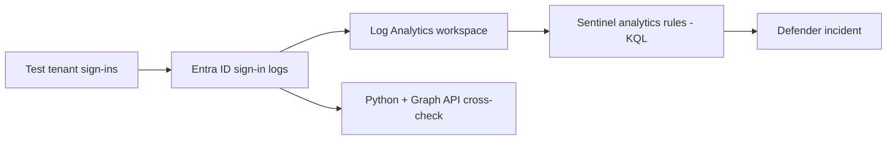

## 1. Lab tenant

A dedicated Entra ID tenant, separate from any production environment, with test users including a privileged test account (`admin-test01`) used for the simulations. Sign-in logs are routed to a Log Analytics workspace through a diagnostic setting, which Sentinel reads.

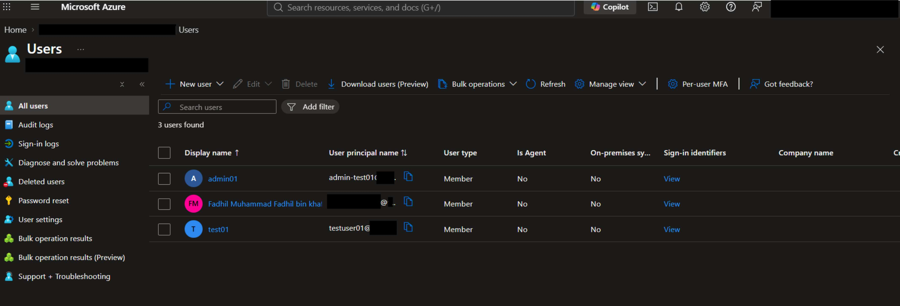

## 2. Prevention: Conditional Access

| Policy | Purpose |
|---|---|
| `require-mfa-for-privileged-access` | Requires MFA for privileged roles; verified against the privileged test account |
| `block-legacy-authentication` | Blocks legacy authentication protocols |

Both policies are set to On.

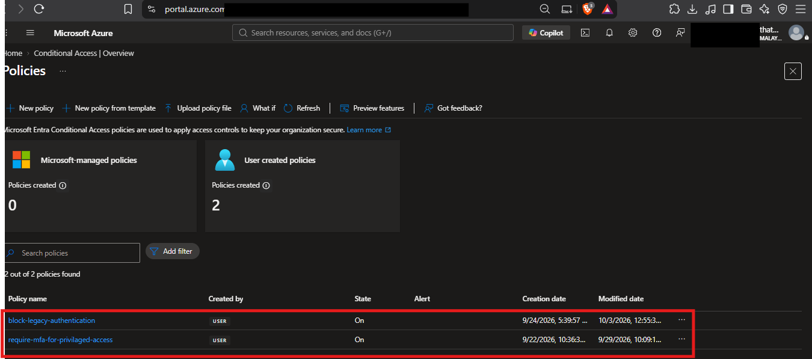

## 3. Attack simulation

- **Failed sign-in burst:** repeated failed sign-ins against `admin-test01` within a short window.
- **Impossible travel:** a successful sign-in, then another shortly after from a different country through a VPN. Run on several dates (26 Sep, 28 Sep, 2 Oct 2026) so the Python cross-check had multiple real pairs to work with.

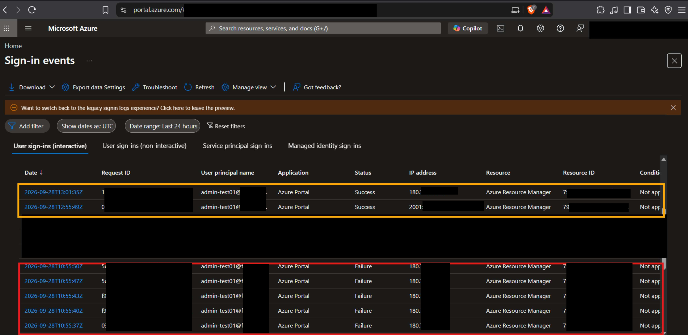

## 4. Detection: KQL and Sentinel analytics rules

**Failed sign-in burst.** Counts failed sign-ins (`ResultType != "0"`) per account in 5-minute bins and flags 5 or more. The simulation produced 14 failures in a single burst.

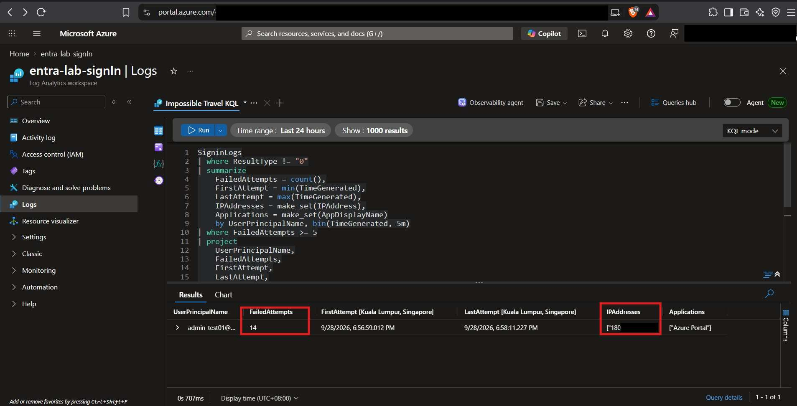

**Impossible travel.** Compares each sign-in with the same user's previous sign-in, calculates the distance between the two geolocated IP addresses, and flags jumps over 500 km.

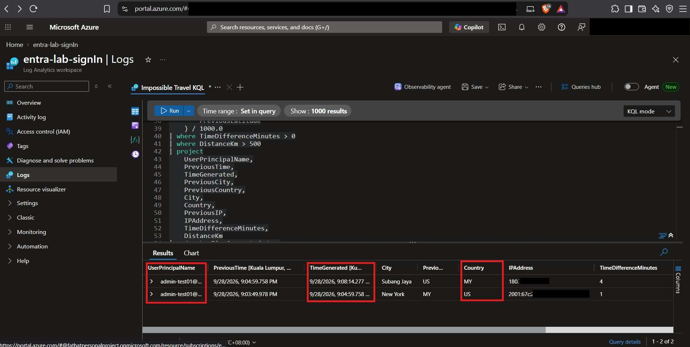

Both queries run as scheduled Sentinel analytics rules (Enabled, Medium severity, every 5 minutes), created through the Microsoft Defender portal, where Sentinel is now managed.

| Rule | Tactic | Technique |
|---|---|---|
| `failed-sign-in-burst` | Credential Access | [T1110.001](https://attack.mitre.org/techniques/T1110/001/) Brute Force: Password Guessing |
| `impossible-travel` | Initial Access, Defense Evasion | [T1078.004](https://attack.mitre.org/techniques/T1078/004/) Valid Accounts: Cloud Accounts |

The burst rule is tagged T1110.001 only. The query counts failures per single account, which is the password-guessing pattern. Password spraying (T1110.003) would need a cross-account view, and password cracking (T1110.002) happens offline and produces no sign-in telemetry. T1078.004 maps to several ATT&CK tactics, so it is tagged under both Initial Access and Defense Evasion.

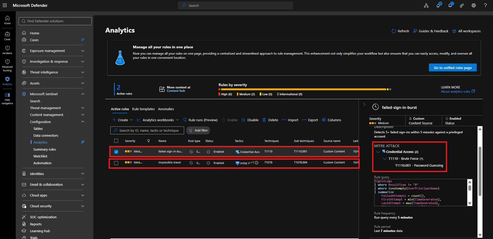

## 5. Incident triage

The impossible-travel rule fired and surfaced in Microsoft Defender as incident 61. The alert's query results include the distance between the two sign-ins (about 9,523 km).

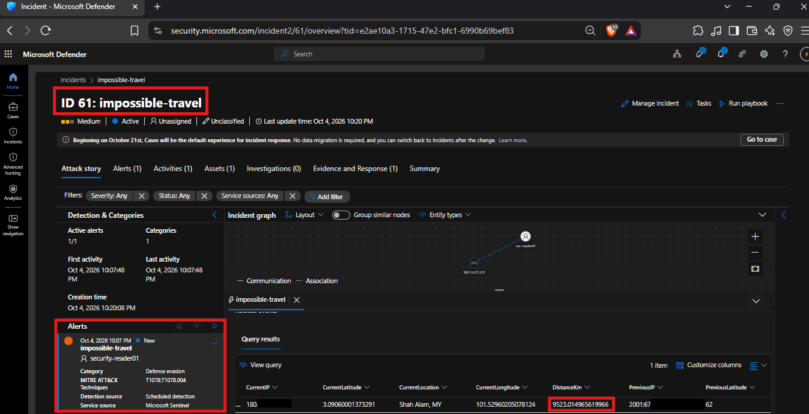

## 6. Independent verification: Python + Microsoft Graph API

`detector.py` reads sign-in logs through the Microsoft Graph API, calculates the distance between consecutive sign-ins per user with the haversine formula, and flags an implied speed above 900 km/h as impossible travel. It confirmed 6 impossible-travel pairs across the three simulation dates, matching what the portal detections showed.

- Uses an app registration with the `AuditLog.Read.All` application permission (admin consent granted).
- Credentials are read from a gitignored `.env` file. No secrets are committed.
- Graph returns coordinates nested under `location.geoCoordinates`, not as flat fields.

## Extra 1: Bulk user provisioning (Microsoft Graph PowerShell)

`Invoke-BulkUserProvisioning.ps1` automates new-hire onboarding from a CSV (`DisplayName`, `UserPrincipalName`, `Department`, `LicenseType`):

1. Connects to Microsoft Graph (`User.ReadWrite.All`, `Group.ReadWrite.All`, `Directory.Read.All`).
2. Creates each user, with a forced password change at first sign-in.
3. Adds the user to the group mapped to their department (`Marketing-Users`, `Finance-Users`, `IT-Users`, `Sales-Users`, `HR-Users`). A missing group is skipped with a warning.
4. Checks the tenant's license SKUs and assigns a matching one if available.
5. Logs the outcome of every step to a CSV.

```powershell
Install-Module Microsoft.Graph -Scope CurrentUser
.\Invoke-BulkUserProvisioning.ps1 -CsvPath .\onboarding_users.csv -LogPath .\provisioning_log.csv
```

**Result:** all 5 users were created and added to the correct groups. No licenses were assigned because the trial tenant had no matching SKUs; the script skips that step instead of failing.

**Design notes**
- `$ErrorActionPreference = "Stop"` is set because Graph cmdlets raise non-terminating errors by default, which silently bypasses `try/catch`.
- A 5-second pause before the group add: a newly created directory object isn't always immediately resolvable, and `New-MgGroupMemberByRef` otherwise fails intermittently with "Invalid target for navigation property update."

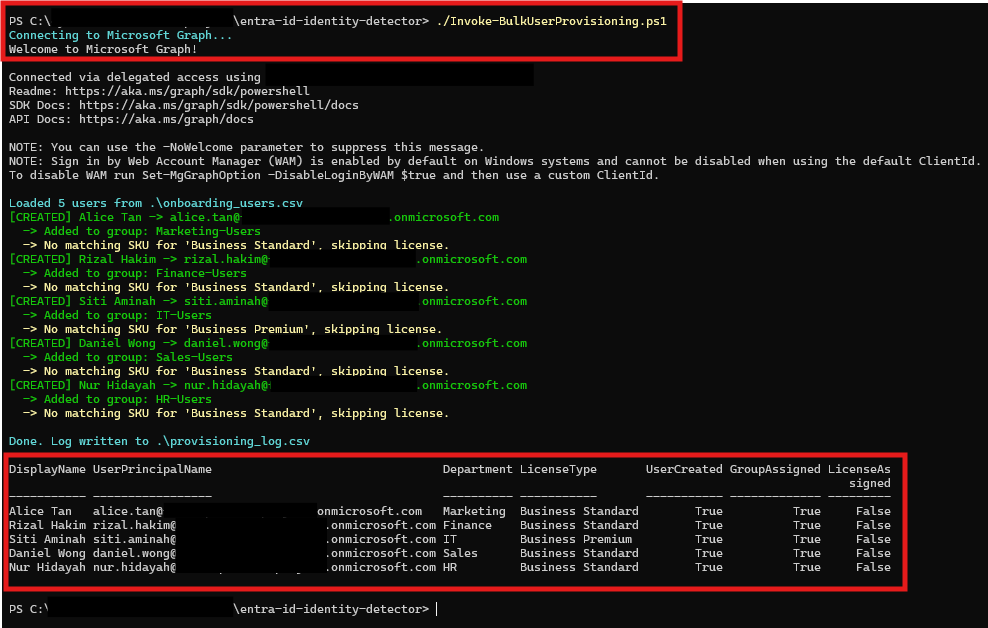
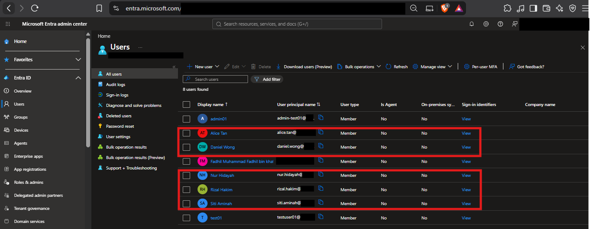

## Extra 2: DLP policy for Malaysian NRIC detection (Microsoft Purview)

- **Policy:** `Detect-Malaysian-NRIC`, created in Microsoft Purview Data Loss Prevention.
- **Condition:** sensitive info type "Malaysia Identity Card Number", chosen over a generic US SSN or credit-card example because it is the data a Malaysian organisation would need to protect under PDPA 2010.
- **Action:** user notification (policy tip). Notify-only; it does not block the message.
- **Test:** sent an email containing a decoy NRIC (fake but correctly formatted). Outlook returned a notification: "Message contains the following sensitive information: Malaysia Identity Card Number."

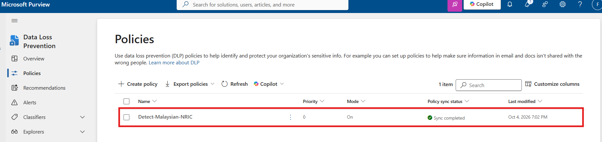
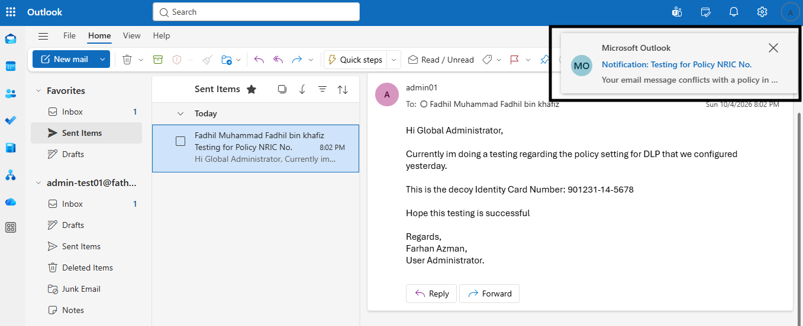
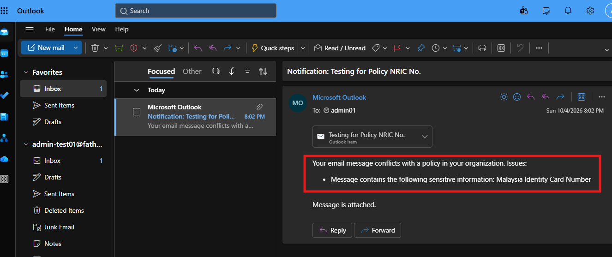

Full write-up, including the detective-vs-preventive control distinction and what would change for production: [`docs/dlp-policy.md`](docs/dlp-policy.md).

## Comparison with SecureBank (AWS)

| | SecureBank (AWS) | Entra ID Identity Detector (Azure) |
|---|---|---|
| Layer | IaaS / network | SaaS-PaaS / identity |
| Attack target | EC2 web server | Entra ID sign-ins |
| Detection stack | Splunk (SPL) | Microsoft Sentinel (KQL) |
| MITRE ATT&CK | T1110.001, T1078, T1550.001 | T1110.001, T1078.004 |

## Limitations

This is a lab, not a production deployment.

- Thresholds (5 failures in 5 minutes, 500 km) were set against a handful of simulated sign-ins and have not been validated against a production baseline.
- Impossible-travel detection based on IP geolocation is prone to false positives from VPNs and mobile carriers. No tuning or allow-listing is included.
- The PowerShell script has no retry logic, no rollback on partial failure, and no input validation beyond what `New-MgUser` enforces. The license-assignment path was not exercised end to end, since the tenant had no matching SKUs.
- The DLP policy is notify-only. The Purview Alerts dashboard had not populated at the time of testing, so verification here is the end-user policy tip.

## References

- [MITRE ATT&CK T1110.001: Brute Force, Password Guessing](https://attack.mitre.org/techniques/T1110/001/)
- [MITRE ATT&CK T1078.004: Valid Accounts, Cloud Accounts](https://attack.mitre.org/techniques/T1078/004/)
